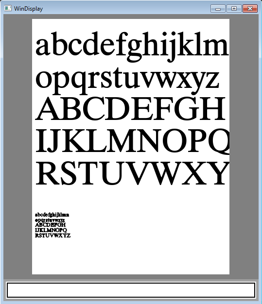

# WinDisplay

A playground for graphics programming.

At this point, it is a font rasterizer (a freetype alternative).

```
subcode: page_content
    page.$set_size 100
    page.$moveto 10, 680
    page.$text_line "abcdefghijklmn"
    page.$text_line "opqrstuvwxyz"
    page.$text_line "ABCDEFGH"
    page.$text_line "IJKLMNOPQ"
    page.$text_line "RSTUVWXYZ"
    page.$set_size 16
    page.$text_line "abcdefghijklmn"
    page.$text_line "opqrstuvwxyz"
    page.$text_line "ABCDEFGH"
    page.$text_line "IJKLMNOPQ"
    page.$text_line "RSTUVWXYZ"
```



Currently it does anti-aliasing (optionally subpixel antialiasing), but as you can see in the capture, it needs an auto-hinting algorithm to display in small pixels.

## Why

The platform API hides all the GUI internals, and open source libraries (such as lib freetype) is too complicated to explore. Having a straight code base with no bells and whistels is more suitable for learning. Also sometime we may wish to have true cross-platform solutions with less complicated dependencies, having a source code that every line of code can be unserstood might be desirable.

## To try

The code is developed with MyDef (a meta layer), but you can directly try with the c files in `out/` folder. Under visual studio command prompt, go to `out/` folder, type `make`, it should compile and produce `test.exe`. It loads `cyberbit.ttf` (replace with your own true type font file, use `grep` to find the location to edit), and displays the text as shown.

## To read

You may directly read the c files in `out` folder, although I would recommend directly read def source, which are shorter and more organized. 

There are four parts currently. `win.def` and `display.def` corresponds to `out/win.c`; `font.def` corresponds to `out/font.c`; `raster.def` corresponds to `out/raster.c`.

* win.def
  Windows stuff, register and create window, hookup message loop.

* display.def
  A display buffer, 4 bytes per pixel. All graphics is basically manipulating this buffer. Set up metrics similar to a PDF page. 

* font.def
  Loads truetype font file, translates char code to glyph index via `cmap`, loads glyph metrics, rasterizes the glyph (using functions from raster.c).

* raster.def
  General purpos antialiasing rasterizer. Main functions are `add_line` and `add_curve`, which uses Xiaolin Wu's line algorithm, modifiled by annotating each pixel with vertical line directions (either up or down), then fills the shape in a scanline fashion. Optionally one can directly rasterize the single pixel anti-aliased outlines.

The win.def to display.def interface (in addition to the snippet shown above):

```
include: win32/bitmap.def
subcode: display_buffer_draw(var, hdc)
    $call draw_dib, hdc, $(var).offset_x, $(var).offset_y, $(var).buffer, $(var).width, $(var).height

subcode: on_draw
    $call fill_background, 808080
    page.$draw hdc
```

The display.def text snippet:
```
fncode: f_disp_add_text(p_disp, s)
    $(set:D=p_disp->$1)
    $(set:G=p_glyf->$1)
    $while *s; s++
        p_glyf = font_render($(D:font), *s)
        tn_x=(int)($(D:x)*$(D:pt))
        tn_y=(int)($(D:y)*$(D:pt))
        $(if:1)
            f_disp_copy_gray(p_disp, tn_x-$(G:x), tn_y-$(G:y), $(G:buf), $(G:w), $(G:h))
        $(else)
            #-- font_subpixel
            f_disp_copy_rgb(p_disp, tn_x-$(G:x), tn_y-$(G:y), $(G:buf), $(G:w), $(G:h))
        $(D:x)+=$(G:advance)/$(D:pt)
```

The font.def snippet (read along with [truetype spec](https://developer.apple.com/fonts/TrueType-Reference-Manual/) ):
```
subcode: raster_glyf
    &call each_point
        $call add_point

    # -----------------------------------
    subcode: add_point
        $call zexpr, tf_z = (tn_z - tn_zmin)*pf->f_px_size
        $call @add_point_transformation
        $if tb_start
            $(if:debug_point)
                $print "start contour: %f, %f", tf_x, tf_y
            $call set_first_point
        $elif tn_flag & 0x1
            $(if:debug_point)
                $print "point %d: %f, %f", i_pt, tf_x, tf_y
            $call raster_on_curve
        $else
            $(if:debug_point)
                $print "point %d: %f, %f - off", i_pt, tf_x, tf_y
            $if tb_curve
                $call raster_skip_curve
            $else
                $call note_off_curve

    subcode: start_contour
        $local tb_start
        $local tf_x_start, tf_y_start
        $local tf_x0, tf_y0, tf_x1, tf_y1, tf_x, tf_y
        tb_start=1
        raster_new_contour()

    subcode: end_contour
        $call zexpr, tf_z = tf_z_start
        $call raster_z0_z1_z
        raster_end_contour()

```

The raster.def snippet:
```
#---- Xiaolin Wu's line algorithm -----------
#- ref: http://en.wikipedia.org/wiki/Xiaolin_Wu%27s_line_algorithm
#-    there is an addition goal to track scanline directions
fncode: raster_line(tf_x0, tf_y0, tf_x1, tf_y1)
    $call @debug
    $call set_raster_dir_add_line
    $call set_steep_swap
    $call set_delta_gradient
    $call calc_ends
    $if tn_x0==tn_x1
        $call raster_single_end
    $else
        $if tb_steep
            #-- x, x+1 pair of pixels ----
            $call raster_start, v
            $call raster_stem, v
            $call raster_finish, v
        $else
            #-- y, y+1 pair of pixels ----
            $call raster_start, h
            $call raster_stem, h
            $call raster_finish, h

# Quadradic Bezier curve
fncode: raster_curve(tf_x0, tf_y0, tf_x1, tf_y1, tf_x2, tf_y2)
    $if fabs(tf_x2-tf_x0)<=1 && fabs(tf_y2-tf_y0)<=1
        raster_line(tf_x0, tf_y0, tf_x2, tf_y2)
    $else
        &call zexpr
            tf_z11 = (tf_z0+tf_z1)/2
            tf_z22 = (tf_z2+tf_z1)/2
            tf_z = (tf_z11+tf_z22)/2
        raster_curve(tf_x0, tf_y0, tf_x11, tf_y11, tf_x, tf_y)
        raster_curve(tf_x, tf_y, tf_x22, tf_y22, tf_x2, tf_y2)
```

## MyDef

As I said, you can go with C source code directly, but going with MyDef source is easier IMHO. You may want to explor [MyDef](http://hz2.org/blog/mydef.html).


